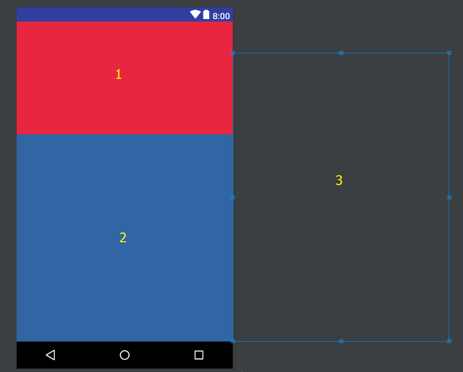

# BHLayout

以主流浏览器首页布局为参考的一个自定义Layout

### 下载安装Demo

[点击下载Demo Apk](./public/apk/app-debug.apk)

-----

自定义ViewGroup实现浏览器首页滑动效果。

自定义的目的：

	1. 完成需求（重中之重）。
	2. 解决使用google自带控件CoordinatorLayout+AppBarLayout+CollapsingToolbarLayout实现此效果的快速滑动的bug。
	3. 避免使用ViewPager实现时使Activity/Fragment代码逻辑变得复杂且庞大的问题。

## 效果

### 360浏览器首页效果图：

[点击查看（图片较大，流量慎点）](./public/images/360_home.gif)

### UC浏览器首页效果图：

[点击查看（图片较大，流量慎点）](./public/images/uc_home.gif)

### 第一个初始效果：

[点击查看（图片较大，流量慎点）](./public/images/first_demo.gif)

### 最终效果（添加一些额外效果后）：

----

## 简单入门：

0. 原理

	此控件由三部分组成，主页header、主页内容和右侧内容，所以子控件数量不能少于三个！如图：

	

0. 导入项目
	
	在项目module的build.gradle中添加：
	
		compile 'cn.ijero.bhlayout:bhlayout:0.1.3'
		
	可能出现无法下载的情况，需要在Project的build.gradle添加一下源：
	
        allprojects {
            repositories {
                jcenter()
            }
        }

0. 资源文件中使用

	在xml中使用BrowserHomeLayout作为根布局，该布局的子布局数量必须大于等于三个：
	
		<?xml version="1.0" encoding="utf-8"?>
		<cn.ijero.bhlayout.BHLayout xmlns:android="http://schemas.android.com/apk/res/android"
		    xmlns:app="http://schemas.android.com/apk/res-auto"
		    xmlns:tools="http://schemas.android.com/tools"
		    android:id="@+id/bhLayout"
		    android:layout_width="match_parent"
		    android:layout_height="match_parent"
		    app:expandedHeight="200dp"
		    app:unexpandedHeight="56dp"
		    app:expanded="true">
	
		    <FrameLayout
		        android:layout_width="match_parent"
		        android:layout_height="match_parent"
		        android:background="#E92640" />
		
		    <FrameLayout
		        android:layout_width="match_parent"
		        android:layout_height="match_parent"
		        android:background="#3265A3" />
		
		    <FrameLayout
		        android:layout_width="match_parent"
		        android:layout_height="match_parent"
		        android:background="#DDDC30" />
		
		</cn.ijero.bhlayout.BHLayout>

4. 属性

		app:expandedHeight="200dp" // 设置header展开的最高高度
	    app:unexpandedHeight="56dp" // 设置header收起的最低高度
	    app:expanded="true" // 设置header默认的展开状态 true为展开，false为收起

0. 监听实现更多效果

	在java中，对BHLayout设置滑动监听器（setOnStateChangeListener），可以实时监听滑动状态，以实现更多的动画效果。可以参考示例程序：[demo](./app)

0. Demo简单示例（Kotlin）：

    package cn.ijero.bhlayout
    
    import android.os.Bundle
    import android.support.v7.app.AppCompatActivity
    import android.support.v7.widget.DividerItemDecoration
    import android.view.View
    import android.view.ViewGroup
    import kotlinx.android.synthetic.main.activity_main.*
    import kotlinx.android.synthetic.main.layout_home_content.*
    import kotlinx.android.synthetic.main.layout_home_header.*
    import kotlinx.android.synthetic.main.layout_right_content.*
    
    class MainActivity : AppCompatActivity(), BHLayout.OnStateChangeListener, BHLayout.OnDragBHLayoutCallback {
        // 该方法的返回结果直接决定了是否支持拖拽
        // 通过返回recyclerView的滑动距离等于0时，才让这个组件进行工作。
        override fun onDragBHLayoutEnable(): Boolean {
            return mainRecyclerView.computeVerticalScrollOffset() == 0
        }
    
        override fun onStateChange(view: View?, state: BHLayout.State, snapState: BHLayout.SnapState, dx: Int, dy: Int) {
            val headerHeight = resources.getDimensionPixelSize(R.dimen.dimen_header_height)
            val toolbarHeight = resources.getDimensionPixelSize(R.dimen.dimen_toolbar_height)
    
            // 根据滑动距离计算搜索框应该移动的位移
            val searchTop = (dy * (dy.toFloat() / (headerHeight + toolbarHeight))).toInt()
            searchBarLayout.top = searchTop
    
            // 设置透明度和位移
            headerWeatherLayout.alpha = dy.toFloat() / (headerHeight - toolbarHeight)
            headerNaviLayout.alpha = dy.toFloat() / (headerHeight - toolbarHeight)
            overrideView.alpha = (1 - dy.toFloat() / (headerHeight - toolbarHeight))
            headerWeatherLayout.top = dy - headerHeight + toolbarHeight + (headerWeatherLayout.layoutParams as ViewGroup.MarginLayoutParams).topMargin
            headerNaviLayout.top = dy - headerNaviLayout.measuredHeight + toolbarHeight - (headerNaviLayout.layoutParams as ViewGroup.MarginLayoutParams).bottomMargin
        }
    
        override fun onCreate(savedInstanceState: Bundle?) {
            super.onCreate(savedInstanceState)
            setContentView(R.layout.activity_main)
    
            browserHomeLayout.apply {
                setOnStateChangeListener(this@MainActivity)
                setOnDragCallback(this@MainActivity)
            }
    
            mainRecyclerView.apply {
                adapter = MainRecyclerAdapter()
                addItemDecoration(DividerItemDecoration(this@MainActivity, DividerItemDecoration.VERTICAL))
            }
    
            rightRecyclerView.apply {
                adapter = RightRecyclerAdapter()
            }
        }
    
    }

0. 简单示例(Java)：

    package cn.ijero.appjava;
    
    import android.support.v7.app.AppCompatActivity;
    import android.os.Bundle;
    import android.support.v7.widget.DividerItemDecoration;
    import android.support.v7.widget.RecyclerView;
    import android.view.View;
    import android.view.ViewGroup;
    import android.widget.LinearLayout;
    
    import cn.ijero.bhlayout.BHLayout;
    
    public class MainActivity extends AppCompatActivity implements BHLayout.OnDragBHLayoutCallback, BHLayout.OnStateChangeListener {
    
        private View weatherLayout;
        private View naviLayout;
        private View overrideView;
        private View searchBarLayout;
    
        @Override
        public boolean onDragBHLayoutEnable() {
            // 返回true表示控件支持拖拽，false则关闭拖拽功能
            return true;
        }
    
        @Override
        public void onStateChange(View view, BHLayout.State state, BHLayout.SnapState snapState, int dx, int dy) {
            int headerHeight = getResources().getDimensionPixelSize(R.dimen.dimen_header_height);
            int toolbarHeight = getResources().getDimensionPixelSize(R.dimen.dimen_toolbar_height);
    
            // 根据滑动距离计算搜索框应该移动的位移
            searchBarLayout.setTop((int) (dy * ((float) dy / (headerHeight + toolbarHeight))));
    
            // 设置透明度和位移
            float alpha = (float) dy / (headerHeight - toolbarHeight);
            weatherLayout.setAlpha(alpha);
            weatherLayout.setTop(dy - headerHeight + toolbarHeight + ((ViewGroup.MarginLayoutParams) weatherLayout.getLayoutParams()).topMargin);
    
            naviLayout.setAlpha(alpha);
            naviLayout.setTop(dy - naviLayout.getMeasuredHeight() + toolbarHeight - ((ViewGroup.MarginLayoutParams) naviLayout.getLayoutParams()).bottomMargin);
    
            overrideView.setAlpha((1 - (float) dy / (headerHeight - toolbarHeight)));
        }
    
        @Override
        protected void onCreate(Bundle savedInstanceState) {
            super.onCreate(savedInstanceState);
            setContentView(R.layout.activity_main);
    
            initHeaderView();
            initMainRecyclerView();
            initBHLayout();
            initRightRecyclerView();
        }
    
        private void initHeaderView() {
            searchBarLayout = findViewById(R.id.searchBarLayout);
            overrideView = findViewById(R.id.overrideView);
            weatherLayout = findViewById(R.id.headerWeatherLayout);
            naviLayout = findViewById(R.id.headerNaviLayout);
        }
    
        private void initRightRecyclerView() {
            RecyclerView rightRecyclerView = findViewById(R.id.rightRecyclerView);
            rightRecyclerView.setAdapter(new RightRecyclerAdapter());
    
        }
    
        private void initMainRecyclerView() {
            RecyclerView homeRecyclerView = findViewById(R.id.mainRecyclerView);
            homeRecyclerView.addItemDecoration(new DividerItemDecoration(this, 0));
            MainRecyclerAdapter mainRecyclerAdapter = new MainRecyclerAdapter();
            homeRecyclerView.setAdapter(mainRecyclerAdapter);
        }
    
        private void initBHLayout() {
            BHLayout bhLayout = findViewById(R.id.browserHomeLayout);
            // 设置拖拽回调，可以通过回调方法控制控件工作状态
            bhLayout.setOnDragCallback(this);
            // 设置状态回调
            bhLayout.setOnStateChangeListener(this);
        }
    
    }

0. 意见反馈

	[提交改进意见或反馈](https://github.com/ijero/browser-home-layout/issues)
	
